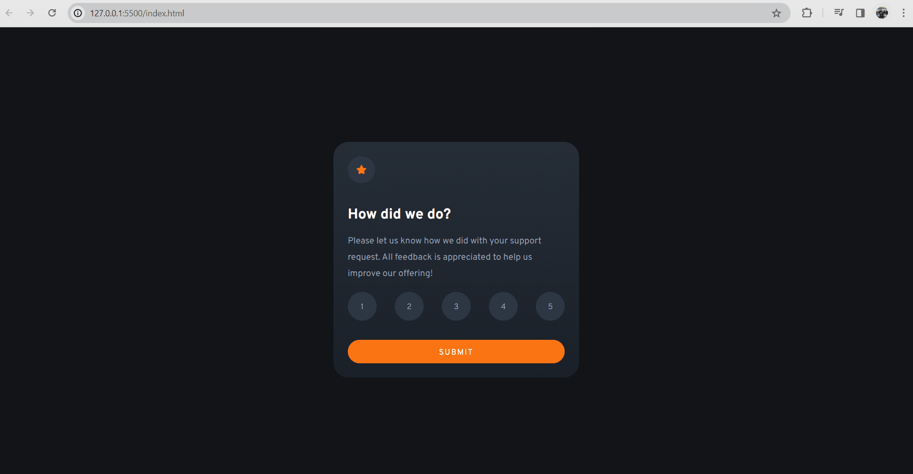

# Frontend Mentor | Interactive rating component

Esta é uma solução para o desafio [Frontend Mentor](https://www.frontendmentor.io/challenges/interactive-rating-component-koxpeBUmI).

## Índice

- [Visão geral](#visão-geral)
  - [O desafio](#o-desafio)
  - [Resultado](#Resultado)
  - [Links](#links)
  - [Construído com](#construído-com)
  - [Linguagens](#linguagens)

## Visão geral

### O desafio

Os usuários devem ser capazes de:

- Ver o layout ideal para o aplicativo dependendo do tamanho da tela do dispositivo;
- Ver os estados de foco para todos os elementos interativos na página;
- Selecionar e enviar uma classificação;
- Ver o estado do cartão "Obrigado" após enviar uma avaliação;
- Conseguir enviar uma nova classificaçaõ;

### Resultado 🖥️

### Links

- Desafio do Frontend Mentor: [Interactive rating component challenge on Frontend Mentor](https://www.frontendmentor.io/challenges/interactive-rating-component-koxpeBUmI)
- Link do projeto: [Visualizar projeto](https://erickf-silva.github.io/interactive-rating-component/)

### Construído com

- **HTML5 Semântico:** Utilizado para estruturar o conteúdo de forma significativa e acessível.
- **CSS Flexbox:** Para criar layouts flexíveis e responsivos.
- **Event Listeners:** Utilizados para capturar interações do usuário, como cliques nos botões de avaliação.
- **DOM Manipulation:** Para modificar dinamicamente o conteúdo da página com base nas interações do usuário.

### Linguagens

- HTML
- CSS
- JavaScript

